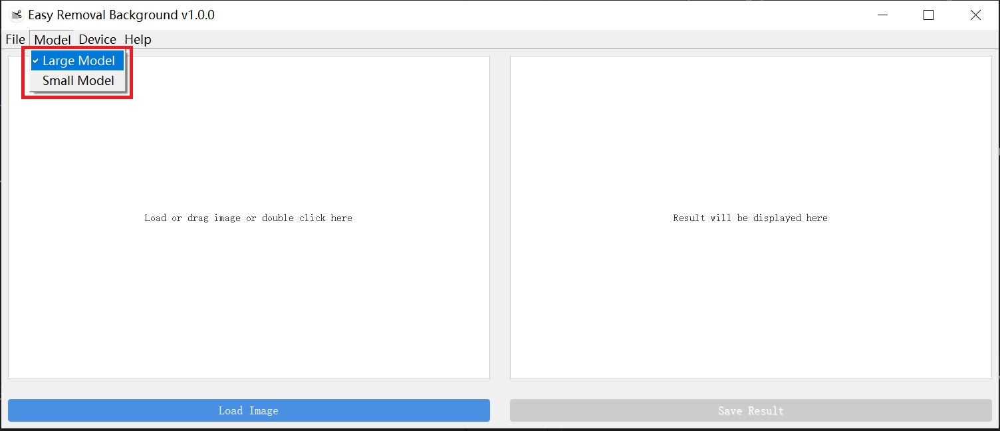
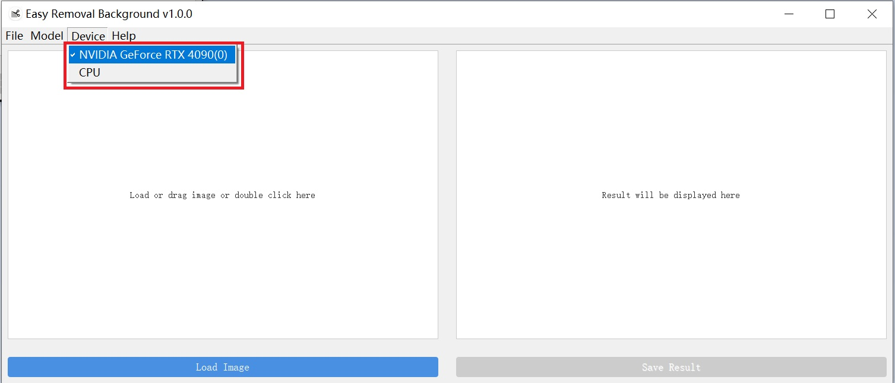
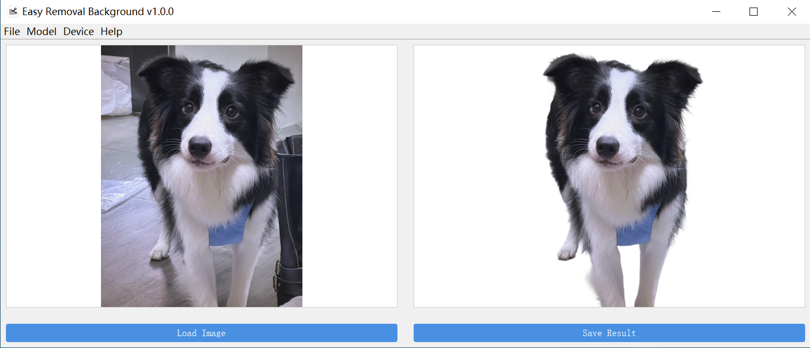

<div align="center">
  <p>
      
  </p>

# Easy Removal Background

</div>


## ⚡ Quick Start

### 1. Run by pre-built binary file

- Download the pre-built binary file from [GoogleDrive](https://drive.google.com/drive/folders/1pTtbxMIw2KGwD1Zi5dUIcp0njg3eab_I) or [BaiduNetdisk](https://pan.baidu.com/s/1CY_Dx8KnNrrd0teA71y9HQ?pwd=easy) (code: `easy`)

- Unzip and run `easyRemovalBackground.exe`

- Drag and drop your image into the left window or click "Load Image" button to select an image file.

- After processing, you can see the result in the right window.

- Save the result by clicking "Save Result" button.

### 2. If you are a developer, you can also build from source code

#### Prerequisites

- Windows 10 or later(we only support windows platform now)
- Visual studio 2022
- CMake (version 3.21.4)
- CUDA (version 12.4)
- Onnxruntime-gpu (version 1.23.2)
- Qt5 development libraries(version 5.14.2)
- OpenCV (version 4.8)
- Spdlog

#### Clone the repository

```bash
git clone https://github.com/zhangming8/easyRemovalBackground.git
cd easyRemovalBackground
```

#### Build and run

```bash
mkdir build && cd build
cmake ..
cmake --build . --config Release
```
#### Run the executable file `easyRemovalBackground.exe` in `Release` folder


## ⛰️ Usage

### Start Page

<div align="center">
  <p>
       
  </p>
</div>

### Select Model

> [!TIP]
> Large model is more accurate but slower, small model is faster but less accurate.

<div align="center">
  <p>
       
  </p>
</div>


### Select Device

> [!TIP]
> If you have a nvidia GPU device, select it to get faster processing speed, otherwise, select "CPU"

<div align="center">
  <p>
       
  </p>
</div>


### Show And Save Result

<div align="center">
  <p>
       
  </p>
</div>


## 📞 Contact

Any questions, discussions, feel free to leave issues here or send me e-mails (ming1451093037@gmail.com).


## 😃 Acknowledgement

This project is based on the [BiRefNet](https://github.com/ZhengPeng7/BiRefNet) model, thanks for their great work!


